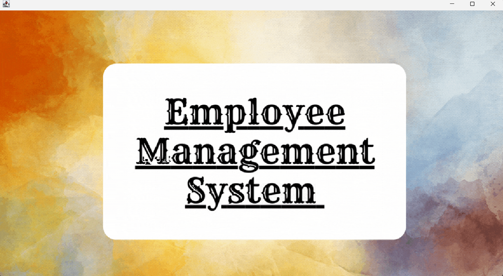
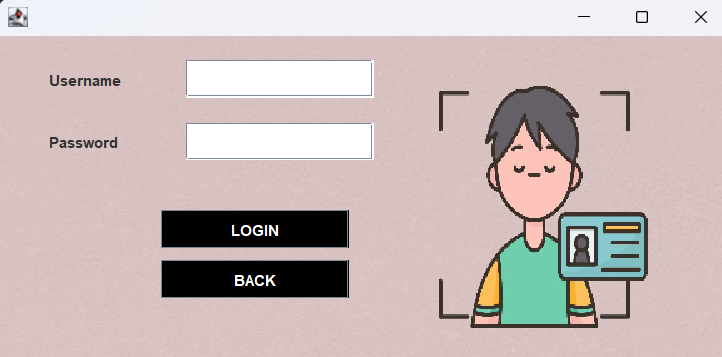
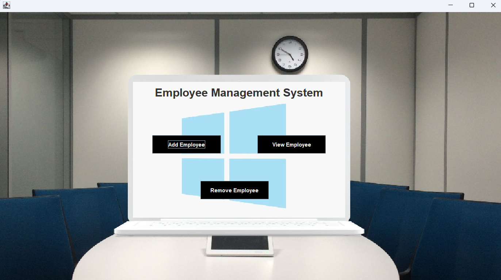
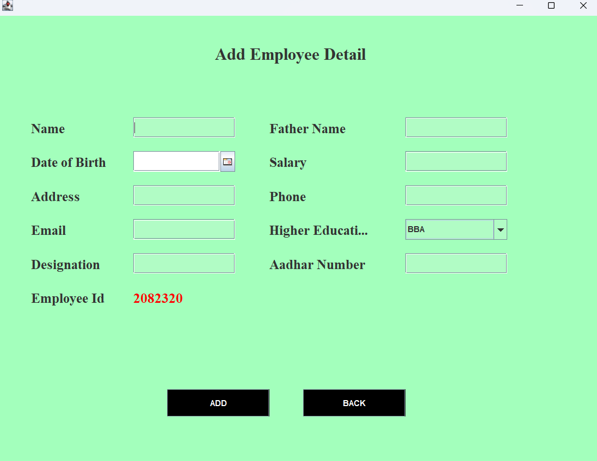
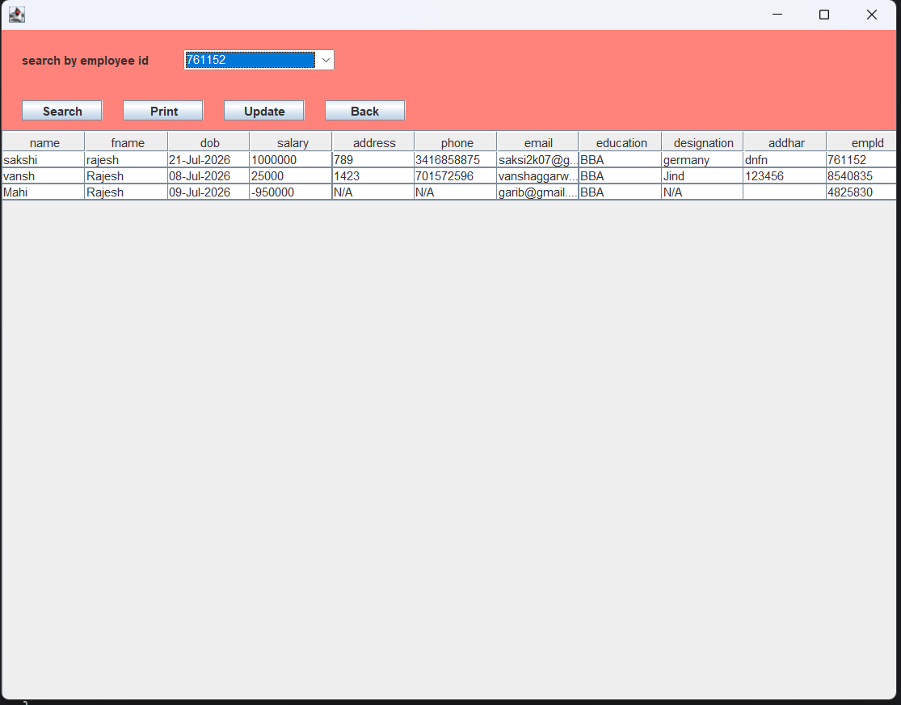
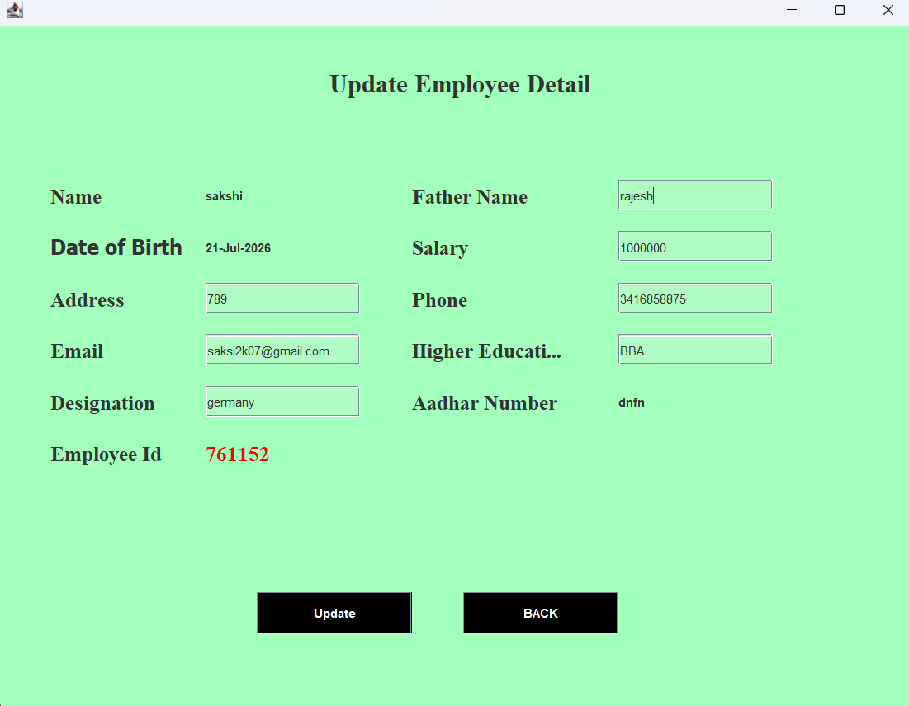
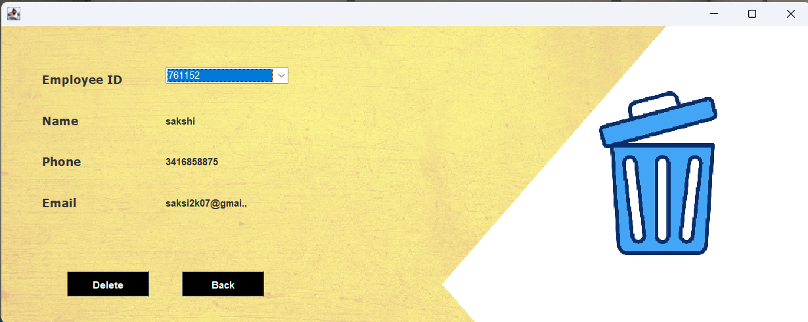

# Employee Management System

A desktop-based **Employee Management System** built using **Java Swing**, **JDBC**, and **MySQL**. The application provides secure login authentication and complete **CRUD (Create, Read, Update, Delete)** functionality to efficiently manage employee records through an intuitive graphical user interface.

---

##  Features

-  Secure Login Authentication
-  Interactive Splash Screen
-  User-friendly Dashboard
-  Add New Employee
-  View Employee Details
-  Update Employee Information
-  Remove Employee Records
-  Auto-generated Employee ID
-  MySQL Database Integration using JDBC
-  Desktop GUI developed with Java Swing

---

##  Tech Stack

- Java
- Java Swing
- JDBC
- MySQL
- Eclipse IDE
- Git & GitHub

---

##  Project Structure

```text
Employee-Management-System/
│── src/
│── screenshots/
│── bin/
│── .classpath
│── .project
│── README.md
```

---

##  How to Run

1. Clone this repository.
2. Import the project into Eclipse IDE.
3. Create the required MySQL database.
4. Update the database username and password in `conn.java`.
5. Run `Splash.java` (or `Main_class.java`) to start the application.

---

## 📸 Project Screenshots

### Splash Screen



---

### Login Page



---

### Dashboard



---

### Add Employee



---

### View Employee



---

### Update Employee



---

### Remove Employee



---

## 🎯 Future Improvements

- Employee Search & Filter
- Role-based Access Control
- Export Employee Records to PDF/Excel
- Profile Image Upload
- Attendance & Payroll Module

---

##  Author

**Vansh**

GitHub: https://github.com/7015577259vansh

---

 If you found this project useful, consider giving it a **Star** on GitHub.
